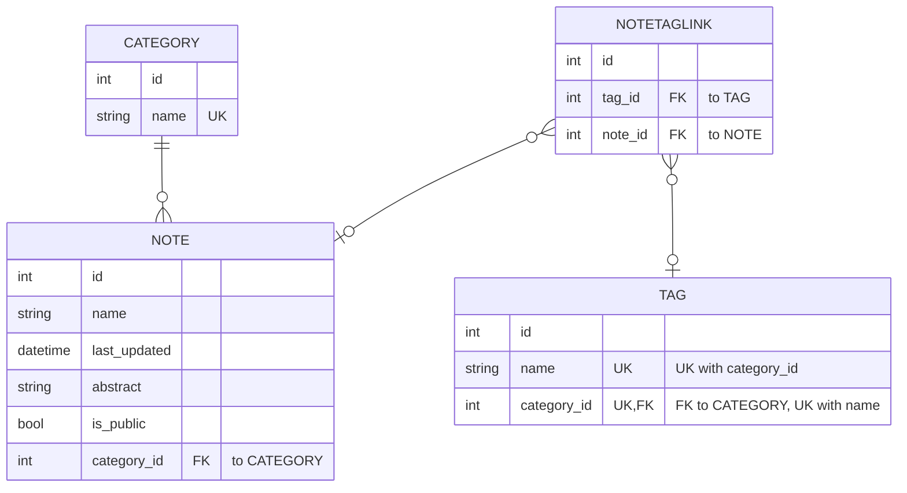

# API to serve notes in markdown

This will be a simple API to serve docs in markdown. 

## TODO list

- Deployment


### Wish list 

- Auto-categorization and auto-tag of uploaded markdowns.

## Data models



## Endpoints

Autodocumented. See swagger ui.

# Running all unit tests from CLI
Better to set the environment variable IN_MEMORY_DB="Yes":
```sh
env IN_MEMORY_DB="Yes" python -m unittest
```