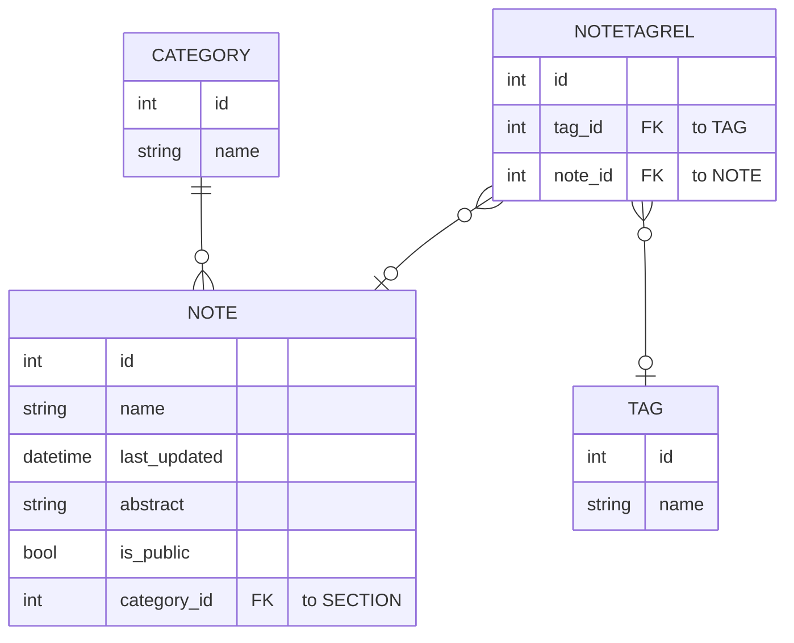

# API to serve notes in markdown

## Data models

```mermaid
erDiagram
    NOTE {
        int id
        string name
        datetime last_updated
        string abstract
        bool is_public
        int category_id FK "to SECTION"
    }
    CATEGORY {
        int id
        string name
    }

    
    TAG {
        int id
        string name
    }
    
    NOTETAGREL {
        int id
        int tag_id FK "to TAG"
        int note_id FK "to NOTE"
    }
    CATEGORY ||--o{ NOTE : ""
    NOTETAGREL }o--o| TAG: ""
    NOTETAGREL }o--o| NOTE: ""
```